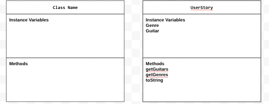

# Unit 2 - Data for Social Good Project

## Introduction

Software engineers develop programs to work with data and provide information to a user. Each user has different needs based on the information they are looking for from data. Your goal is to create a data analysis program for your user that stores and analyzes data to provide the information they need.

## Requirements

Use your knowledge of object-oriented programming, one-dimensional (1D) arrays, and algorithms to create your data analysis program:
- **Write a class** – Write a class to represent your user or business and store and analyze their data with no-argument and parameterized constructors.
- **Create at least two 1D arrays** – Create at least two 1D arrays to store the data that your user needs information about.
- **Write a method** – Write a method that finds or manipulates the elements in a 1D array to provide the information your user needs.
- **Implement a toString() method** – Write a toString() method that returns general information about the data (for example, number of values in the dataset).
- **Document your code** – Use comments to explain the purpose of the methods and code segments and note any preconditions and postconditions.

## User Story 

> As a Guitar Enthusiast,   
> I want to I want to analyze which styles of guitars are most commonly used across different music genres,   
> so that I can better understand how specific guitar designs, pickups, and tonal characteristics contribute to the unique sound of each genre.

## Dataset 

Dataset: https://docs.google.com/spreadsheets/d/1t7ouV459XWuGNvBjyZ_YBZDHQi19MBldeyjIE-oM30w/edit?usp=sharing 
- **Genre** (String) - genre or type of music 
- **Band** (String) - band for the genre
- **Guitar** (String) - guitar used by the band

## UML Diagram 

 

## Description 

Our project uses three columns from the dataset, has three methods, three arrays a parameterized constructor, no-argument constructor, and a toString method. In the tester class we instatiate a UserStory object and print it. The goal of this project is to find out which type of guitar is best for each genre. We use the dataset to pair up genres, bands, and guitars allowing us to find which guitar is most used.